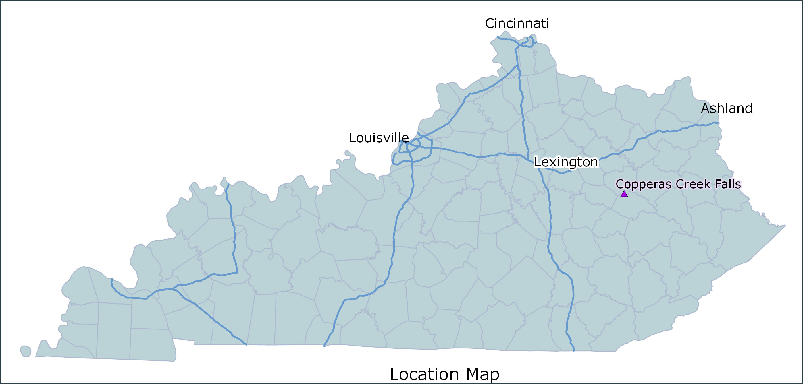
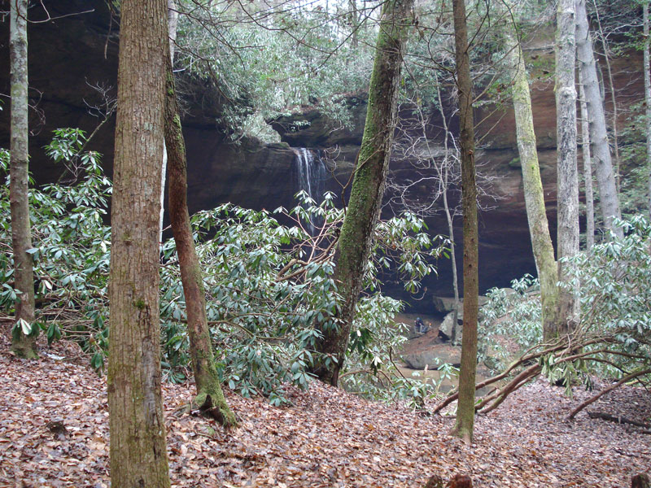
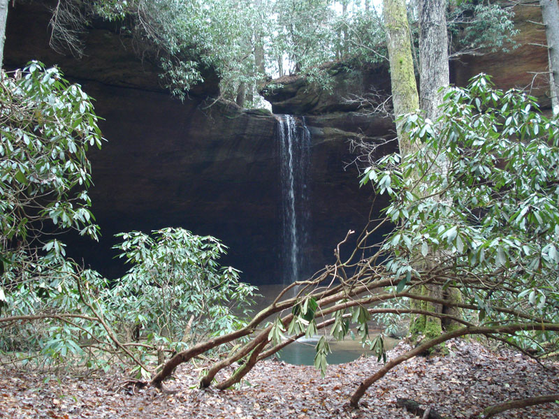
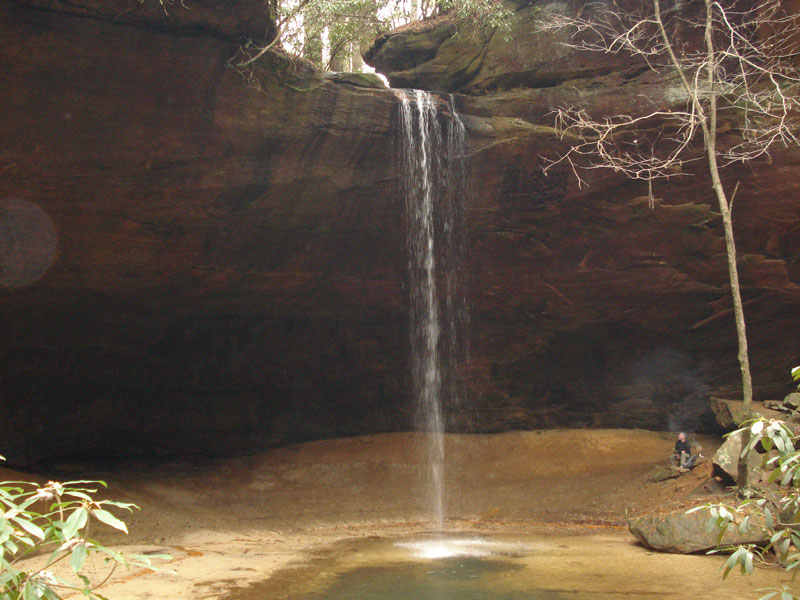
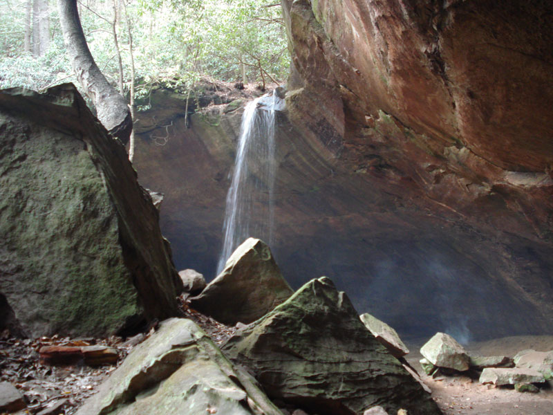
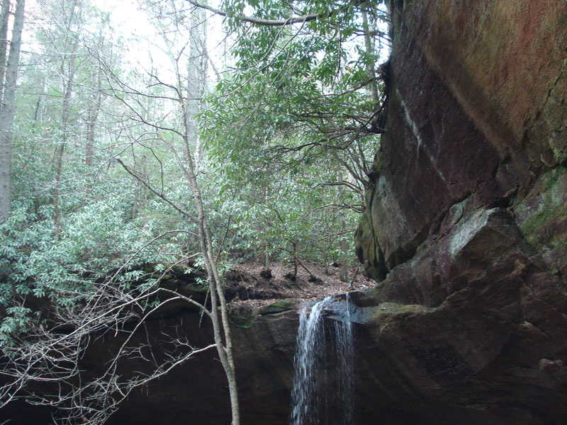
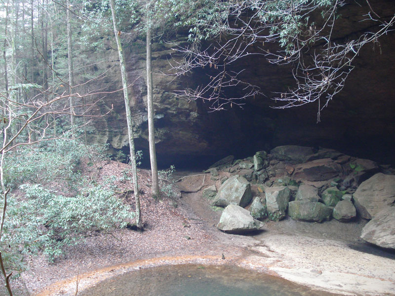
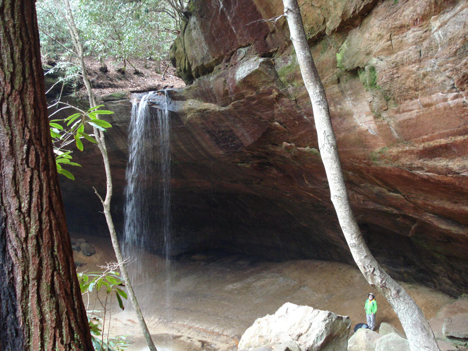

## A project that explores Copperas Creek Waterfall
### in Red River Gorge National Geological Area    

(created in ArcGIS Pro)    

- [Table of Contents](#table-of-contents)
    - [Introduction](#Introduction)
        - [Natural Features](##Natural-Features)
        - [Heritage Features](#Heritage-Features)
    - [Building a web page](#building-a-web-page)

### Introduction 

This is a project for University of Kentucky, Geography 409, fall 2018. Using ArcGIS Pro, Python programming, Markdown language, and Visual Studio Code as tools, our task was to explore one or more geologic features in Red River Gorge, and document our analyses. A variety of data was accessed and analyzed; we made use in particular of the high quality LIDAR data made available through the Commonwealth of Kentucky's Elevation Data & Aerial Photography Program [KyFromAbove](http://kyfromabove.ky.gov/)    

#### Natural Features

The Red River Gorge has numerous natural features of interest, including many streams feeding the Red River, with captivating waterfalls and plunge pools. There are many rock arches and rock shelters or overhangs. A rich diversity of plant life fills the many different microclimates and habitat niches in the gorge.

    
Source: Federal Highway Administration, Red River Gorge Scenic Byway [website](https://www.fhwa.dot.gov/byways/byways/2482/photos/all)

#### Heritage Features

The Red River Gorge has both archaeological and historical features within it. Rock shelters were used by prehistoric people, and, if undisturbed, may contain clues to their culture. Camping, digging, and firebuilding are prohibited in rock shelters in the Gorge and the rest of the Daniel Boone National Forest. Gladie Historic Site features a reconstructed cabin from the late 1800s, interpreting aspects of life in that era.

#### Waterfalls

"Falls" features were extracted from a text file downloaded from the Domestic and Antarctic Names (State and Topical Gazetteer) files published by the United States Board on Geographic Names. (geonames.usgs.gov) , using Python code. Data accessed October, 2018. Geographic points were created from latitude and longitude fields in the text file. Elevation data was extracted from lidar point cloud data maintained by Kentucky's Elevation Data & Aerial Photography Program(KyFromAbove)

### Bird's-eye view animation

* [45-second video](https://www.youtube.com/embed/s5qwNqC6_UA)

*(Source: one video made in lab 7)*

### Maps 

* [Base map of popular Red River Gorge arches](basemap/rrg.pdf) *(lab 5)*
* [Cliffs over 40 feet](Elevation/CopperasCreekCliffs.jpg) *(lab 7)*

### Web pages 

* [Welcome to the Red River Gorge](../index.html) *(lab 1)*
* [Explore the falls](copperasc-creek-falls) *(lab 8)*

### Photographs

     
caption

     
caption

     
caption

     
caption

     
caption

     
caption

     
caption

*(Source: five photographs made in lab 5)*

## Final project 

For a super-polished version of final project, you should add content to your two web pages.

The lab 1 [Welcome to the Red River Gorge](../index.html) web page needs to have the following assets added:

* [Base map of popular Red River Gorge arches](basemap/rrg.pdf) *(lab 5)*
* A link to the [Explore the falls](copperasc-creek-falls) *(lab 8)* web page

The lab 8 [Explore the falls](copperasc-creek-falls) *(lab 8)* web page needs to have the following assets added:

* [45-second video](https://www.youtube.com/embed/s5qwNqC6_UA) (lab 7)*
* [Cliffs over 40 feet] map(Elevation/CopperasCreekCliffs.jpg) *(lab 7)*
* Photographs *(lab 5)*
* Summary information/narrative about falls that includes measures of landform, e.g., height, width, etc. 

